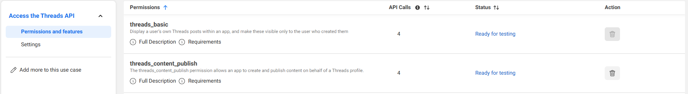
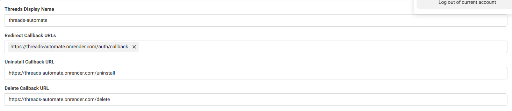

# 🧵 Threads Automation API – FastAPI + Render

This project allows you to post to [Meta Threads](https://www.threads.net) programmatically via the **Threads API**,
using a secure backend powered by **FastAPI** and deployed on **Render**.

---

## 🚀 Features

- Full OAuth2 flow (via Meta Threads)
- Post new Threads (with or without image)
- Publish Threads after creation
- Combined route to post and publish in one go
- Designed to work perfectly with **Postman**

---

## 🛠️ Setup & Deployment

### 1. 🧰 Environment Variables (`.env`)

Create a `.env` file locally or configure these in your Render dashboard:

```env
APP_ID=your_meta_app_id
APP_SECRET=your_meta_app_secret
REDIRECT_URI=https://your-app-name.onrender.com/auth/callback
```

### 2. 🚀 Deploying to Render

Render handles HTTPS out of the box, making it perfect for Threads API integration.

Create a file called render.yaml:

```yaml
services:
  - type: web
    name: threads-automate
    env: python
    buildCommand: "pip install -r requirements.txt"
    startCommand: "uvicorn main:app --host 0.0.0.0 --port 10000"
    envVars:
      - key: APP_ID
        sync: false
      - key: APP_SECRET
        sync: false
      - key: REDIRECT_URI
        sync: false
```

Then push to your connected GitHub repo and let Render auto-deploy it with HTTPS support. Make sure this project is
pushed to a GitHub repository.


### 3. Setting up meta developer account

1. Go to the [Meta App Dashboard](https://developers.facebook.com/apps).
2. Click **“Create App”** and choose **Business** or **None** (either works for testing).
3. Enter basic app info (name, email, etc.).
4. Once created, you'll land in the App Dashboard.

In the permissions and features, make sure you have these perms given


In the Settings, make sure you have these settings

The name of my project in render was called threads-automate. This is why the redirect callback URL and other stuff has
that specific URL.

### 4. 📦 Install dependencies (if running locally) --THIS WONT WORK FOR THREADS LOCALLY SINCE IT NEEDS HTTPS

```bash
pip install -r requirements.txt
```

## 🌐 API Endpoints (Postman-friendly)

Use in browser only

Initiates the OAuth login flow:

```python
https: // your - app - name.onrender.com / login
```

## 🔄 GET /auth/callback

```python
{
    "access_token": "EAABsbCS1iHg...",
    ...
}
```

## 🔁 POST /post-and-publish-thread

```python
{
    "access_token": "your_access_token_here",
    "text": "This one goes straight to Threads 🚀",
    "image_url": "https://your-image-url.com/image.jpg" // optional
}
```

### 3. Add Instagram Testers (for Threads access)

1. In the left sidebar, go to **“Roles” > “Roles” > “Instagram Testers”**.
2. Click **“Add Instagram Testers”**.
3. Enter your **Instagram username** (must be the same account you'll log in with on Threads).
4. Save and send the invitation.

---

### 4. Accept the Invitation

1. Go to [https://www.instagram.com/accounts/manage_access](https://www.instagram.com/accounts/manage_access) **on the web (not the app)**.
2. Log in with the Instagram account you invited.
3. Accept the invitation under the “Apps and Websites” section.

---

### 5. Configure OAuth Settings

1. In your Meta App, go to **“Settings > Basic”** and copy your **App ID** and **App Secret**.
2. Then go to **“Facebook Login > Settings”**:
   - Add your **Redirect URI** (e.g. `https://your-app-name.onrender.com/auth/callback`)
   - Enable `web` login type.

---

### 6. Use Credentials in `.env`

Paste your values into the `.env` file (locally or in Render's dashboard):

```env
APP_ID=your_meta_app_id
APP_SECRET=your_meta_app_secret
REDIRECT_URI=https://your-app-name.onrender.com/auth/callback
```